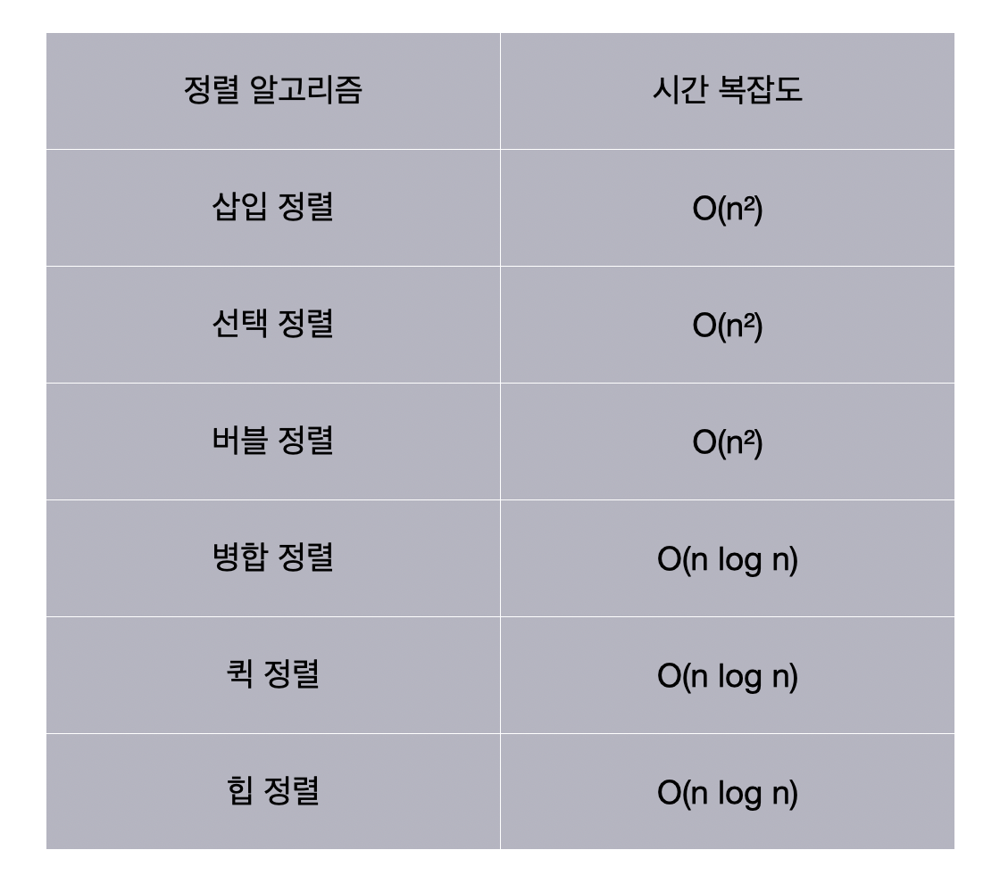

# 시간 복잡도(Time Complexity)

입력의 크기에 따른 프로그램 실행 시간의 관계.

 

## 빅 오 표기법(Big O Notation)

함수의 점근적 상한을 표기하는 방법. 가장 대중적으로 사용된다.

입력의 크기 n에 대한 빅 오 표기법 = 실행 시간의 O(상한(n)) 형태로 표현된다.

즉, 입력하는 n이 무한대로 커진다고 하더라도 실행 시간이 일정(상한) 이상 커지지 않는 다는 의미이다.

e.g. O(n²) = 입력값 n이 증가하더라도 실행 시간의 증가율이 n²보다는 작다.

 

 

## 빅 세타 표기법(Big Θ Notation)

입력에 대한 평균적인 실행 시간.

e.g. Θ(n²) = 입력값 n이 증가하더라도 실행 시간의 증가율은 n²과 같다.

 

## 빅 오메가 표기법(Big Ω Notation)

입력에 대한 실행 시간의 점근적 하한.

e.g. Ω(n²) = 입력값 n이 증가하더라도 실행 시간의 증가율은 n²보다 크다.

 

# 공간 복잡도(Space Complexity)

프로그램이 실행되었을 때 필요한 메모리 자원의 양.

시간 복잡도와 마찬가지로 빅 오 표기법으로 표현한다.

입력에 따라 필요한 메모리 자원의 양에 대한 점근적 상한을 표기하는 방법이다.

 

## 예상 질문

1. 빅 오 표기법의 시간 복잡도 크기 순서를 설명해 주세요.

 

## 참고 자료

강민철. 『이것이 취업을 위한 컴퓨터 과학이다 with CS 기술 면접』. 한빛미디어, 2024.
