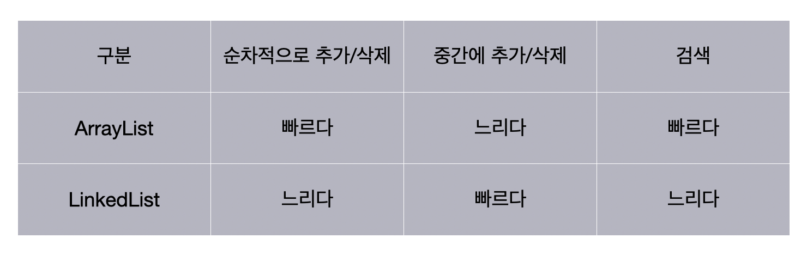

# 컬렉션(Collection)

java.util 패키지에서 제공하는 객체를 추가, 삭제, 검색할 수 있는 인터페이스와 구현 클래스.

</br>

## List

순서가 있고, 중복을 허용하는 자료구조.

</br>

### ArrayList

배열을 이용하여 만든 리스트.

```Java
List<E> list = new ArrayList<E>();
List<E> list = new ArrayList<>();
```

</br>

### Vector

배열을 이용하여 만들어지고, thread safe한 리스트.

동기화된 메서드로 구성되어 있어 멀티 스레드가 동시에 벡터의 메서드를 실행할 수 없고, 하나의 스레드가 메서드를 실행 완료해야 다른 스레드가 메서드를 실행할 수 있다.  
-> 멀티 스레드 환경에서 안전하게 객체를 추가, 삭제할 수 있다.  
= thread safe

```Java
List<E> list = new Vector<E>();
List<E> list = new Vector<>();
```

</br>

### LinkedList

연결 리스트를 이용하여 만든 리스트.

```Java
List<E> list = new LinkedList<E>();
List<E> list = new LinkedList<>();
```

</br>



## Set

중복을 허용하지 않고, 순서를 보장하지 않는 자료구조.

</br>

### HashSet

Hashtable을 이용하여 만든 Set.

```Java
Set<E> set = new HashSet<E>();
Set<E> set = new HashSet<>();
```

</br>

## Map

키-값의 쌍을 저장하는 자료구조.

키는 중복이 불가능하고, 값은 중복이 가능하다.

</br>

### HashMap

Hashtable을 이용하여 만든 Map.

```Java
Map<K, V> map = new HashMap<K, V>();
Map<K, V> map = new HashMap<>();
```

</br>

### Hashtable

HashMap과 동일한 내부 구조.

thread safe하다.

```Java
Map<K, V> map = new Hashtable<K, V>();
Map<K, V> map = new Hashtable<>();
```

</br>

## 예상 질문

1. 컬렉션 프레임워크에 대해 설명해 주세요.

2. Vector와 List의 차이에 대해 설명해 주세요.

</br>

## 참고 자료

신용권. 『혼자 공부하는 자바』. 한빛미디어, 2019.
