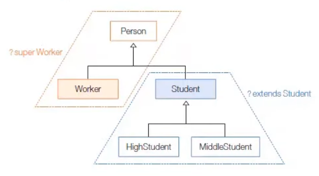

# Generic

## 제네릭이란?

제네릭: 결정되지 않은 타입을 파라미터로 처리하고, 실제 사용할 때 파라미터를 구체적인 타입으로 대체시키는 기능

```Java
public class Box <T> {
    public T content;
}
```

위 코드에서는, Box 클래스에서 결정되지 않은 content의 타입을 T라는 타입 파라미터로 정의했다. 지금은 T가 무슨 타입이 될지 모르지만, Box 객체가 생성될 시점에 다른 어떠한 타입으로 대체될 것이라는 의미.

만약 Box의 content를 String 타입으로 저장하고 싶다면

```Java
Box<String> box = new Box<String>(); // 여기에서 new Box<>() 로도 표현 가능하다.
box.content = "Hi";
String content = box.content; // box의 content를 String 타입으로 바로 받을 수 있다.
```

만약 Box의 content에 숫자를 저장하고 싶다면

```Java
Box<Integer> box = new Box<Integer>(); // 여기에서 new Box<>() 로도 표현 가능하다.
box.content = 100;
int content = box.content; // box의 content를 int 타입으로 바로 받을 수 있다.
```

여기서 주의할 점은, 타입 파라미터(T)를 대체할 무언가는 클래스 및 인터페이스여야만 한다.  
예를 들어, `Box<int>` 는 불가하다.

## 제네릭 타입

제네릭 타입: 결정되지 않은 타입을 파라미터로 가지는 클래스, 인터페이스

```Java
public class 클래스명<A,B, ... >{ ... }
public interface 인터페이스명<A,B, ... >{ ... }
```

- 타입 파라미터는 주로 대문자 알파벳 한 글자로 표현한다. (A, B, T 등)
- 외부에서 제네릭 타입을 사용하려면 타입 파라미터에 구체적인 타입을 지정해야한다.
  - 지정하지 않은 경우, Object 타입이 암묵적으로 사용됨

## 제네릭 메소드

제네릭 메소드: 타입 파라미터를 가지고 있는 메소드로, 타입 파라미터(A, B, T 등)이 메소드 선언부에서 정의된다.

```Java
public <A,B, ...> 리턴타입 메소드명(매개변수, ... ) { ... }
```

```Java
// 제네릭 메소드 정의
public <T> Box<T> boxing(T t){ ... }

// 제네릭 메소드 호출
Box<Integer> box1 = boxing(100);
Box<String> box2 = boxing("홍길동");
```

- 위 코드는 T 타입을 파라미터로 받고, T 타입을 내용물로 갖는 Box 객체를 리턴한다.

## 제한된 타입 파라미터

어떤 경우에는 타입 파라미터를 조금 구체화해서 제한해야하는 경우가 있다. 예를 들어, 타입 파라미터를 숫자만 가능하게끔 제한해야하는 경우, 제네릭 메소드는 Number 또는 그 자식 클래스(Byte, Short, Integer, Long, Double)로 제한해야 한다.  
이처럼 모든 타입으로 대체하는 것이 아니라, 특정 타입과 자식/구현 관계에 있는 타입만 대체할 수 있는 타입 파라미터를 **제한된 타입 파라미터**라고 한다.

```Java
public <T extends 상위타입> 리턴타입 메소드(매개변수, ...) { ... }
```

이제 타입 파라미터가 Number 타입으로 제한되었으므로, Object의 메소드뿐만 아니라, Number가 가지고 있는 메소드도 사용할 수 있음.

## 와일드카드 타입 파라미터



- 타입 파라미터의 대체 타입으로 Student와, 그의 자식 클래스인 HighStudent, MiddleStudent만 가능하도록 매개변수 선언하기
  ```Java
  리턴타입 메소드명(제네릭타입<? extends Student> 변수){ ... }
  ```
- Worker와 자신의 부모 클래스인 Person만 가능하도록 매개변수 선언하기
  ```Java
  리턴타입 메소드명(제네릭타입<? super Worker> 변수) { ... }
  ```
- 어떤 타입이든 가능하도록 매개변수 선언하기

  ```Java
  리턴타입 메소드명(제네릭타입<?> 변수){ ... }
  ```

## 예상 질문

1. 제네릭에 대해 설명해주시고, 왜 쓰는지 알려주세요.
<!-- 공부한 내용을 바탕으로 예상 질문을 최소 1개 이상 작성해주세요.-->

## 참고 자료

- 이것이 자바다(신용권, 임경균)
- [온라인 자바 스터디 #14 - 제네릭(Generic)](https://dev-coco.tistory.com/28)
  <!-- 공부 과정에서 참고한 자료가 있다면, 첨부해주세요-->
  <!-- * [자료주제](링크)  -->
