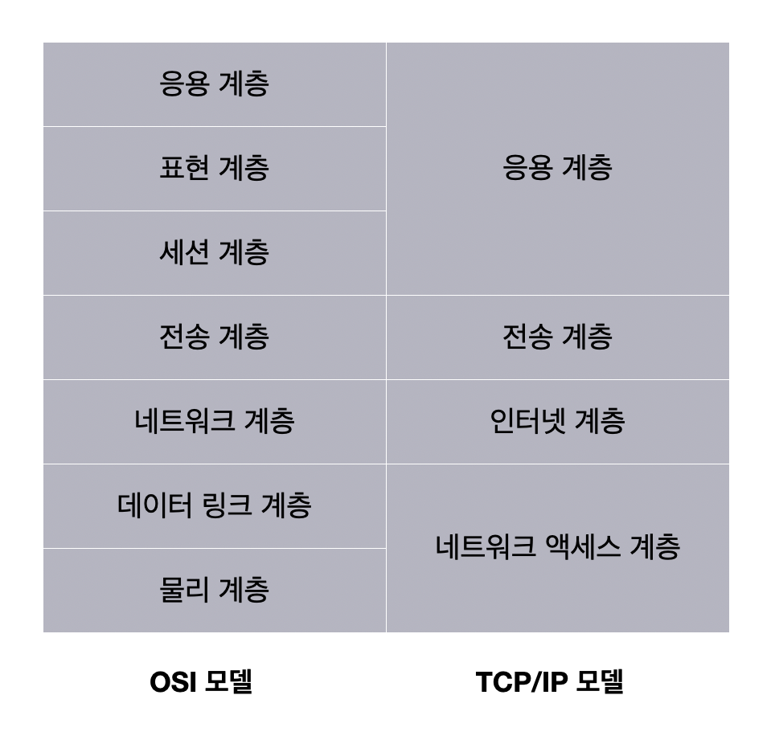

# 네트워크 참조 모델(Network Reference Model)

네트워크 내의 호스트 간에 패킷을 주고 받는 과정(통신)이 이루어지는 단계를 계층적으로 표현한 것.

패킷을 송신하는 쪽에서는 상위 계층 -> 하위 계층으로 정보를 보낸다.

패킷을 수신하는 쪽에서는 하위 계층 -> 상위 계층으로 정보를 받아들인다.

 

## OSI 모델(OSI Model)

국제 표준화 기구 ISO에서 만든 네트워크 참조 모델.

통신 단계를 7개의 계층으로 나눠 OSI 7계층이라고 한다.

 

- 물리 계층(Physical Layer)

  최하위 계층으로, 비트 신호를 주고받는 계층.

  기계어를 비트 신호로 바꿔 유무선 통신 매체를 통해 운반하는 계층이다.

   

- 데이터 링크 계층(Data Link Layer)

  같은 LAN에 속한 호스트끼리 올바르게 정보를 주고받기 위한 계층.

  물리 계층과 연관된 계층이며, 하드웨어와 맞닿아 있는 계층이다.

   

- 네트워크 계층(Network Layer)

  네트워크 간 통신을 가능하게 하는 계층.

  LAN을 넘어 다른 네트워크와 통신을 주고받기 위해 필요한 계층이다.

  대표적인 프로토콜은 IP이다.

   

- 전송 계층(Transport Layer)

  패킷의 송수신 과정에서 신뢰성 있는 전송을 가능하게 하는 계층.

  포트를 통해 특정 응용 프로그램과의 연결 역할을 수행하는 계층이다.

  대표적인 프로토콜로 TCP, UDP가 있다.

   

- 세션 계층(Session Layer)

  응용 프로그램간의 연결 상태를 의미하는 세션을 관리하기 위한 계층.

  연결 상태를 유지하거나 생성, 연결을 끊는 역할을 한다.

   

- 표현 계층(Presentation Layer)

  인코딩, 압축, 암호화 같은 작업을 수행하는 계층.

  세션 계층과 표현 계층은 두 계층을 명확하게 구분하지 않거나 응용 계층에 포함하는 경우가 많다.

   

- 응용 계층(Application Layer)

  여러 네트워크 서비스를 제공하는 계층.

  대표적인 프로토콜로 HTTP, HTTPS, DNS 등이 있다.

   

## TCP/IP 모델 (TCP/IP Model)

이론적 기술을 목적으로 사용하는 OSI 모델과 달리, 구현과 프로토콜에 중점을 둔 네트워크 참조 모델.

 

 

## 예상 질문

1. OSI 7계층과 각 계층에 대해 설명해 주세요.

 

## 참고 자료

강민철. 『이것이 취업을 위한 컴퓨터 과학이다』. 한빛미디어, 2024.
