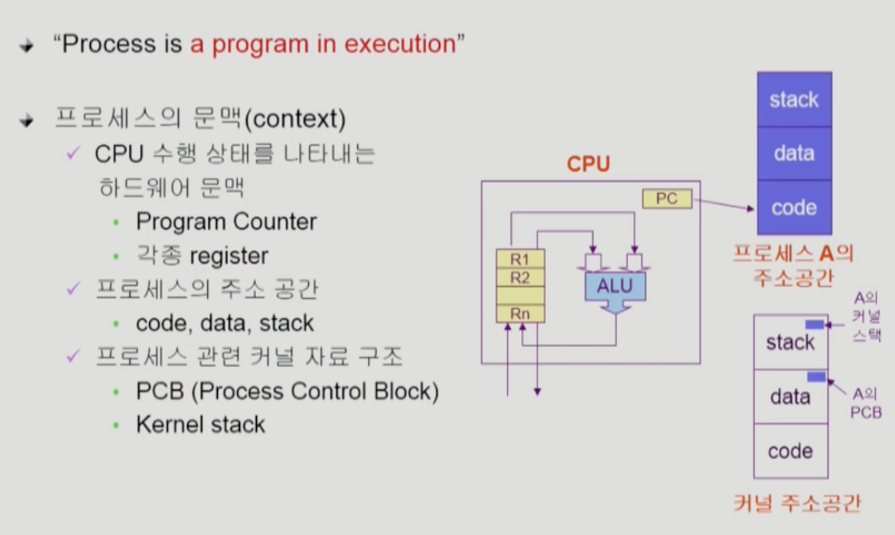
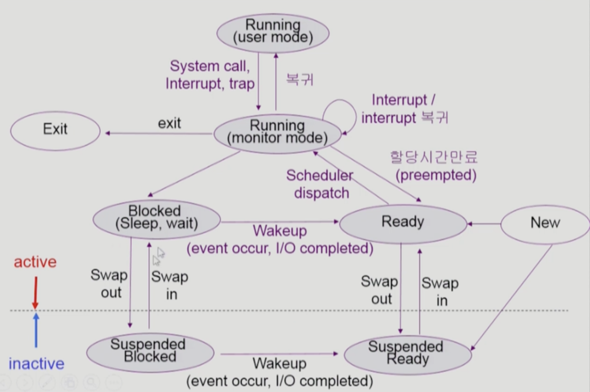
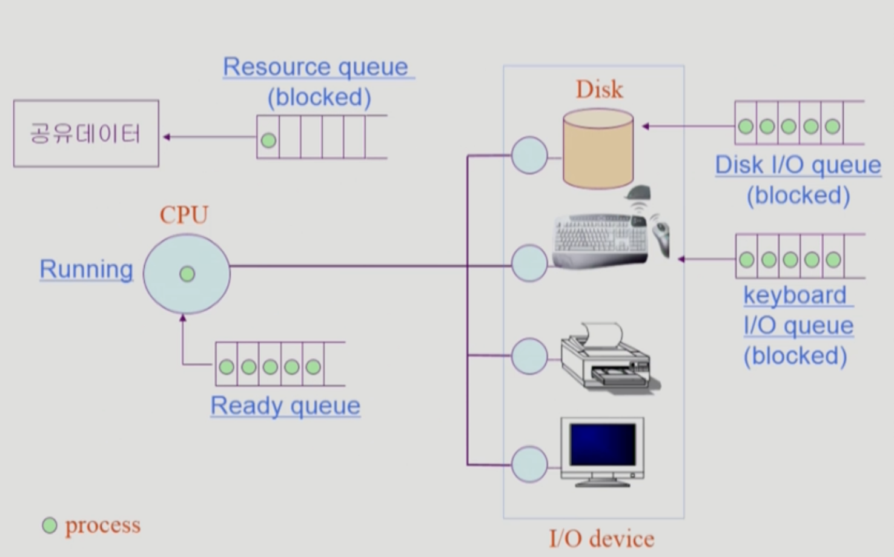
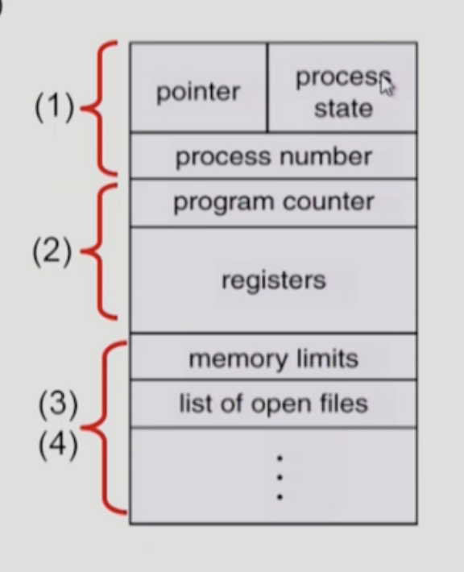
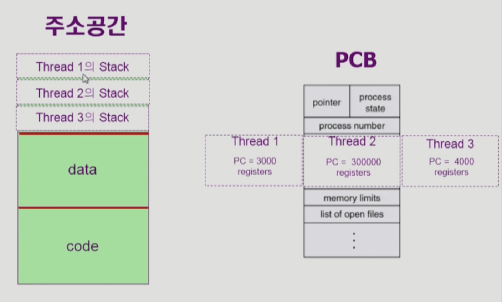
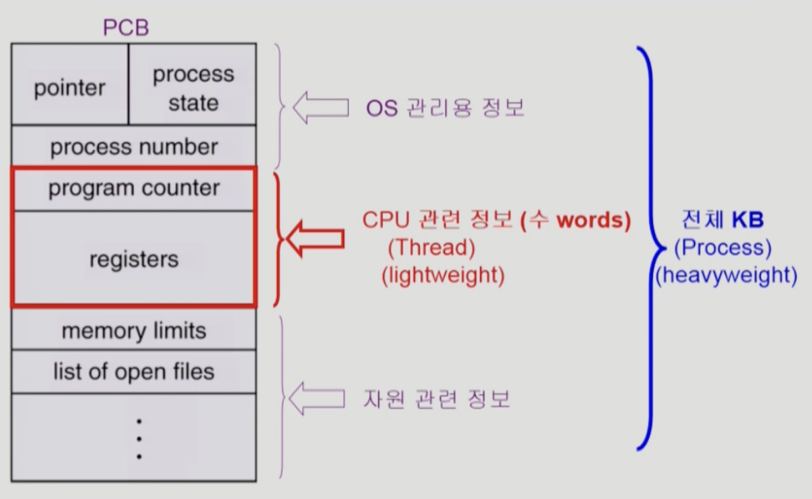

# <!-- 주제 -->

# 1. 프로세스의 개념

프로세스는 실행중인 프로그램을 의미한다.

프로세스의 문맥: 프로세스가 현재 어떤 상태인가

- CPU 수행 상태를 나타내는 하드웨어 문맥
  - Progeam Counter
  - 각종 register
- 프로세스의 주소 공간
  - code, data, stack
- 프로세스 관련 커널 자료 구조
  - PCB (Process Control Block)
  - Kernel stack

 

# 2. 프로세스의 상태

프로세스는 상태(state)가 변경되면서 수행된다.

## Active status

### Running

- CPU를 잡고 instruction을 수행중인 상태
- running 상태에 들어간 프로세스는 일정 시간동안 CPU 사용권을 가진다.
  - 주어진 시간을 다 쓰고도 작업이 끝나지 않았다면, 프로세스는 ready 상태로 돌아와 다음 차례를 기다린다.

### Ready

- CPU를 기다리는 상태(메모리 등 다른 모든 조건은 만족하고, CPU만 필요한 상태)
- 어떤 프로세스가 다음으로 실행될지는 CPU 스케줄러가 결정한다.

### Blocked (wait, sleep)

- CPU를 주어도 당장 instruction을 수행할 수 없는 상태
- Process 자신이 요청한 event(I/O 등)이 만족되지 않아서 이걸 기다리는 상태
  - ex) 디스크에서 파일을 읽어와야 하는 경우
- I/O 작업이 끝나면 인터럽트를 받고, 해당 프로세스는 ready 상태로 가서 자신의 차례를 기다린다

### New

- 프로세스가 생성중인 상태

### Terminated

- 프로세스 수행이 끝난 상태, 아직 종료가 되기 전인 상태

## Inactive status

### pause

- ctrl + Z 를 누른 경우, 프로세스가 일시 정지된다. (종료된 건 아님)
- 프로세스가 메모리에 그대로 존재하고, PCB도 유지된다. 그냥 잠시 멈췄을 뿐이다
- 프로세스를 멈춘 지점에서부터 재시작할 수 있다.

### Suspended (stopped)

- 외부적인 이유로 프로세스의 수행이 정지된 상태
- 프로세스는 통째로 메모리에서 쫓겨나, 디스크에 swap out된다
- ex
  - 메모리에 너무 많은 프로세스가 올라와 있을 때 = 중기 스케줄러 때문에 메모리에서 쫓겨난 경우
  - 프로그램에 오류가 있어서 실행을 미루어야 할 때
  - 바이러스와 같이 악의적인 공격을 하는 프로세스라고 판단될 때
  - 매우 긴 주기로 반복되는 프로세스라서 메모리 밖으로 쫓아내도 괜찮을 때
  - 입출력을 기다리는 프로세스의 입출력 작업이 계속 지연될 때
- Suspended blocked: Blocked 상태에서 swap out된 상태
  - I/O 작업이 완료되면 Suspended ready 상태로 이동한다
- Suspended ready: Ready 상태에서 swap out된 상태

Blocked: 자신이 요청한 event가 만족되면 Ready 상태가 된다  
Suspended: 외부에서 resume해 주어야 Active가 된다.

 

프로세스가 I/O 요청을 함 (disk에서 파일 읽어오기)

1. 프로세스의 상태가 Running → Blocked로 바뀜
2. Disk I/O queue에 가서 줄을 선다
3. disk는 컨트롤러의 지휘 하에 queue에 있는 요청을 처리함, 해당 프로세스의 I/O 작업 끝나면 CPU에게 인터럽트 건다
4. CPU는 인터럽트를 받음, 하던 작업을 멈추고 CPU 제어권을 운영체제 커널에게 넘김
5. 운영체제는 프로세스가 요청한 I/O 작업의 결과 데이터를 해당 프로세스의 메모리 공간에 저장하고, 프로세스의 상태를 Blocked → Ready로 변경함

 

# 3. PCB (Process Control Block)

PCB: 운영체제가 각 프로세스를 관리하기 위해 프로세스당 유지하는 정보

- PCB는 운영체제 영역에 만들어진다.
- 프로세스가 실행되면 PCB가 생성되고, 프로세스가 종료되면 PCB가 삭제된다.
- 운영체제 자체도 프로세스이고, 메모리 위에서 실행된다.
- 컴퓨터에는 일반 사용자의 사용자 프로세스와 운영체제의 커널 프로세스 모두 실행된다.

## PCB 구성 요소

1. OS가 관리상 사용하는 정보
   1. Process state, Process ID
   2. scheduling information, priority
2. CPU 수행 관련 하드웨어 값
   1. Program counter, registers
3. 메모리 관련
   1. COde, data, stack의 위치 정보
4. 파일 관련
   1. open file descroptors (이 프로세스가 open하고 있는 파일이 어떤건지) …

# 4. Thread

하나의 프로세스 내부에 CPU 실행 단위

- 하나의 프로세스에 대해 code, data, stack이 만들어짐
- PCB의 program counter에서 현재 메모리의 어느 부분을 실행하고 있는지 가리키고 있음

그런데 동일한 일을 하는 프로세스가 여러개, 별도로 두면 주소공간이 각각 만들어져서 메모리 낭비가 됨

→ 주소공간은 메모리에 하나만 띄워 놓고, program counter와 register를 여러개 둬서 CPU 실행 단위를 여러개 둔다.

## Thread의 구성

- program counter
- register set
- stack

스레드: 하나의 프로세스에서, 공유할 수 있는 부분은 최대한 공유하고 CPU 수행과 관련된 정보(PC, register, stack)만 별도로 가진다

Thread들끼리 공유하는 부분

- code 영역
- data 영역
- OS 자원

## Thread의 장점

- Responsiveness(응답성)
  - 스레드 하나가 blocked(waiting)상태 일 때, 다른 스레드를 running할 수 있어서 응답 시간이 빨라진다.
- Resource Sharing(자원 공유)
  - 같은 일을 하는 프로세스를 여러개 만들면 메모리 자원이 낭비됨, 스레드로 자원을 절약할 수 있다.
- Economy(경제성)
  - 프로세스를 하나 만드는 overhead > 프로세스 안에 스레드 하나를 만드는 overhead
  - 프로세스 간 CPU switching > 스레드 간 CPU switching
- Utilization of MP Architectures(CPU 여러개)
  - 병렬성을 높일 수 있다. (CPU가 여러개인 환경에서만. 각각 CPU에서 각 스레드를 병렬적으로 실행)

## 예상 질문

1. 프로세스의 상태에는 어떤 것들이 있는지 설명해주세요.
2. 프로세스의 I/O 요청을 처리하는 과정을 설명해주세요.
3. 스레드가 무엇인지, 그리고 스레드를 왜 사용하는지 설명해주세요.

## 참고 자료

<!-- 공부 과정에서 참고한 자료가 있다면, 첨부해주세요-->
<!-- * [자료주제](링크)  -->

- [KOCW - 운영체제 (반효경)](http://www.kocw.net/home/cview.do?cid=3646706b4347ef09)
- 쉽게 배우는 운영체제
