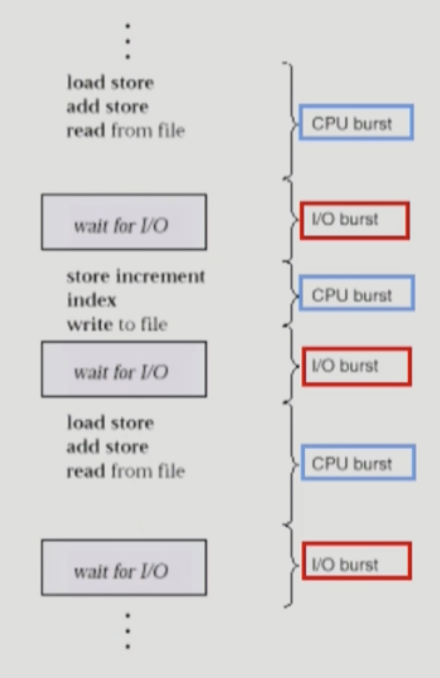
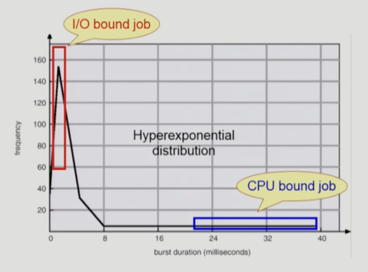

# 1. CPU and I/O Bursts in Program Execution

프로그램을 아래와 같은 flow로 실행이 된다.

- CPU를 잡고 명령어를 실행하다가, 오래걸리는 I/O 작업을 만나면 I/O 작업이 끝날때까지 기다렸다가 완료가 되면 ready 상태로 돌아온다.
- 위와 같이 CPU burst와 I/O burst를 반복하며 실행된다.
  - 프로그램 종류에 따라 CPU ↔ I/O 전환이 잦을 수도, 드물 수도 있다.

## CPU-burst Time의 분포

- CPU burst가 짧은 (중간에 I/O burst가 끼어드는) 경우가 많다. = I/O bound job
- CPU burst가 긴 경우는 빈도가 낮다. = CPU bound job

여러 종류의 job 들이 섞여 있기 때문에 CPU 스케줄링이 필요하다.

## 프로세스의 특성 분류

프로세스는 그 특성에 따라 두 가지로 나눌 수 있다.

- I/O-bound process: CPU를 잡고 계산하는 시간보다 I/O에 많은 시간이 필요함
- CPU-bound process: 계산 위주의 job

# 2. CPU Scheduler & Dispatcher

CPU Scheduler

- Ready 상태의 프로세스 중에서 이번에 CPU 사용권을 줄 프로세스를 고른다.
- 독립적인 하드웨어 장치가 아니라, OS 안에서 CPU scheduling을 하는 코드가 있다.

Dispatcher

- CPU의 제어권을 CPU scheduler에 의해 선택된 프로세스에게 넘기는 역할을 한다.
- context switch를 실행하는 역할.
- 기존에 실행하던 프로세스의 context를 저장하고, 새로 실행할 프로세스의 context를 불러오는 역할

CPU 스케줄링이 필요한 경우

1. Running → Blocked (I/O 요청하는 시스템 콜)
2. Running → Ready (timer interrupt)
3. Blocked → Ready (I/O 완료 후 인터럽트)
4. Terminate (프로세스가 종료된 경우)

1,4번 스케줄링은 **nonpreemptive**, 강제로 빼앗지 않고 자진해서 CPU를 반납하는 것

2,3번 스케줄링은 **preemptive**, 강제로 CPU 사용권 뺏는 것

# 3. Scheduling Algorithms

nonpreemptive, preemptive 유형으로 나눌 수 있다.

- nonpreemptive: 프로그램이 한번 CPU 사용권을 잡으면, 사용이 끝날 때까지 계속 사용할 수 있게 하는 것
- preemptive: 프로그램에게 CPU 사용권 줬다가 뺏는 것

1. FCFS
2. SJF
3. SRTF
4. Priority Scheduling
5. RR
6. Multilevel Queue
7. Multilevel Feedback Queue

위 알고리즘들의 스케줄링 성능을 평가하기 위한 척도

- CPU utilization (이용률)
  - CPU를 최대한으로 이용하는가
  - 전체 시간 중에서, CPU가 놀지 않고 일을 한 시간의 비율
- Throughput (처리량)
  - 특정 시간동안 완료되는 프로세스의 양
  - 프로세스가 실행되서 종료될때까지가 아니고, 하나의 CPU burst에 대함. CPU 사용하러 들어와서 I/O하러 나가기까지의 구간 시간
- Turnaround time (소요시간, 반환시간)
  - CPU 사용하러 들어와서, 다 쓰고 나갈 때까지 걸린 시간
  - CPU 사용 줄을 선 순간부터 CPU burst가 끝나서 나갈 때까지 걸린 시간
  - waiting time + CPU burst 시간
- Waiting time (대기 시간)
  - CPU 사용 줄을 서서 기다린 시간
- Response time (응답 시간)
  - CPU 사용 ready queue에 들어와서, 처음으로 CPU 사용권을 얻기까지 기다린 시간
  - waiting time과 response time은 다르다. 한 번의 CPU burst 동안에도 여러번의 대기 상태가 있을 수 있음

## FCFS (First-Come First-Served)

CPU ready queue에 들어온 순서대로 CPU 사용권을 준다.

- nonpreemptive

Convoy Effect: 긴 process들이 먼저 들어와서 짧은 process들이 오래 기다려야하는 현상

## SJF (Shortest Job First), SRTF (Shortest-Remaining-Time-First)

각 프로세스의 다음번 CPU burst time을 가지고 스케줄링

CPU burst time이 가장 짧은 프로세스에게 제일 먼저 사용권을 줌

- nonpreemptive: 일단 CPU를 잡으면 이번 CPU burst가 완료될 때까지 CPU를 선점당하지 않음
- preemptive: 현재 수행중인 프로세스의 남은 burst time보다 더 짧은 CPU burst time을 가지는 새로운 프로세스가 도착하면 CPU를 뺏어 간다.
  - 이걸 **Shortest-Remaining-Time-First (SRTF)**라고 부른다.

주어진 프로세스들에 대해 average waitiing time이 가장 짧음을 보장한다. (SRTF)

### 문제점

- Starvation: SJF는 CPU 사용시간이 짧은 애들에게 먼저 사용권을 주기 때문에, CPU 사용시간이 긴 애들은 영원히 사용권을 못받을 수 있다.
- 다음번 CPU burst time을 미리 알 수 없다. 각각의 프로세스들이 CPU를 얼마나 쓰고 나갈지 알 수 없음.
  - CPU 사용시간을 추정해서 사용함 (과거에 얼마나 썼는지를 통해 예측)

## Priority Scheduling

highest priority를 가진 프로세스에게 CPU 할당

- nonpreemptive: 우선순위가 더 높은 프로세스가 도착해도 CPU 사용권 뺏지 않고 다 쓸 때까지 기다림
- preemptive: 우선순위가 더 높은 프로세스가 도착했을 때 CPU를 뺏어서 그 프로세스에게 줄 수 있음

사실상 SJF도 priority scheduling이다. 우선순위 점수를 CPU burst time으로 둔 것.

### 문제점

- Starvation: 우선순위가 낮은 프로세스는 영원히 사용권을 못 얻을 수 있다.

## Round Robin (RR)

Round Robin 스케줄링은 각 프로세스에게 동일한 시간 할당량(quantum)을 주고, 이 시간이 끝나면 프로세스를 대기열의 끝으로 보내는 방식으로 CPU를 할당한다.

- preemptive 스케줄링: 정해진 시간 할당량이 지나면 CPU는 해당 프로세스에서 다른 프로세스로 넘어간다.

시간 할당량이 충분히 크면 FCFS와 동일하게 동작한다.

시간 할당량이 너무 작으면 프로세스 간의 문맥 전환(context switch) 횟수가 증가해 오버헤드가 커진다.

이 방식은 **fairness**를 보장하는 특성이 있다. 모든 프로세스가 일정 시간마다 CPU를 할당받기 때문에, 긴 프로세스도 너무 오래 기다리지 않고 CPU를 사용할 수 있다.

### 문제점

- 시간 할당량이 적절하지 않으면 문맥 전환 오버헤드가 증가해 비효율적이 될 수 있다.
- CPU 사용량이 적은 프로세스에게 비효율적일 수 있다.

## 예상 질문

1. 스케줄링 알고리즘을 선택할 때 고려해야 할 요소들은 무엇인가요?
2. 스케줄링 알고리즘에는 무엇이 있는지, 그리고 그 각각 알고리즘에는 어떤 장점과 단점이 있는지 간단하게 설명해주세요.

## 참고 자료

- [KOCW - 운영체제 (반효경)](http://www.kocw.net/home/cview.do?cid=3646706b4347ef09)
- 쉽게 배우는 운영체제
