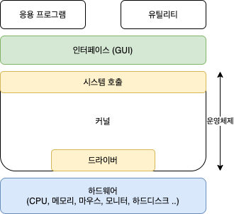
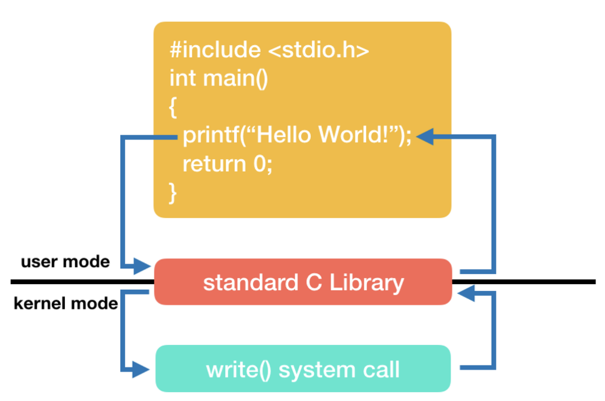

# System Call

<!-- 공부한 내용을 자유롭게 정리합니다.-->

## 커널과 인터페이스

커널: 프로세스 관리, 메모리 관리, 저장장치 관리와 같은 운영체제의 핵심 기능을 모아놓은 것

- ex) 유닉스, 리눅스 등

인터페이스: 커널에 사용자(응용 프로그램)의 명령을 전달하고, 실행결과를 사용자(응용 프로그램)에게 알려주는 역할을 함

- ex) csh, tsh, bash 등

## 이중 모드와 시스템 호출

  
시스템 호출은 커널이 자기 자신을 보호하기 위해 만든 인터페이스이다. 커널은 사용자나 응용 프로그램으로부터 컴퓨터 자원을 보호하기 위해 자원에 직접 접근하는 것을 차단한다.  
이런 보호가 없다면? 응용 프로그램이 CPU, 메모리, 하드 디스크 등에 마음대로 접근하고 조작할 수 있게 됨.  
=> 운영체제는 응용 프로그램들이 자원에 접근하려고 할 때에 오직 자신을 통해서만 접근 가능하도록 하여 자원을 보호함, 이러한 운영체제의 자원 보호 역할은 **이중 모드**를 통해 구현된다.

### 이중 모드

이중 모드: CPU가 명령어를 실행하는 모드를 크게 사용자 모드와 커널 모드로 구분. CPU는 명령어를 사용자 모드로써 실행할 수도, 커널 모드로써 실행할 수도 있다.

- 사용자 모드
  - 커널 영역의 코드를 실행할 수 없는 모드
  - 사용자 모드로 실행 중인 CPU는 입출력 명령어와 같이 하드웨어 자원을 필요로 하는 명령어는 실행할 수 없다
  - 일반적인 응용 프로그램은 기본적으로 사용자 모드로 실행되고, 하드웨어 자원에 접근할 수 없다
- 커널 모드
  - 커널 영역의 코드를 실행할 수 있는 모드
  - 자원에 접근하는 명령어를 비롯한 모든 명령어 실행 가능
  - 운영체제는 커널 모드로 실행되므로, 자원에 접근 가능하다

### 시스템 호출

사용자 모드로 실행되는 응용 프로그램이 어떠한 자원에 접근하는 운영체제의 서비스를 이용하려면, 운영체제에 요청을 보내 CPU가 커널 모드로 전환되어야 한다.  
이 때 운영체제의 서비스를 제공받기 위한 요청을 시스템 호출(System Call)이라고 한다.  
일반적인 응용 프로그램의 실행 흐름은 아래와 같다.

### printf() 함수 사용 예제

## 시스템 호출의 종류

| 종류             | 시스템 호출 | 설명                               |
| ---------------- | ----------- | ---------------------------------- |
| 프로세스 관리    | fork()      | 새 자식 프로세스 생성              |
|                  | execve()    | 프로세스 실행                      |
|                  | exit()      | 프로세스 종료                      |
|                  | waitpid()   | 자식 프로세스가 종료할 때까지 대기 |
| 파일 관리        | open()      | 파일 열기                          |
|                  | close()     | 파일 닫기                          |
|                  | read()      | 파일 읽기                          |
|                  | write()     | 파일 쓰기                          |
|                  | stat()      | 파일 정보 획득                     |
| 디렉토리 관리    | chdir()     | 작업 디렉토리 변경                 |
|                  | mkdir()     | 작업 디렉토리 생성                 |
|                  | rmdir()     | 비어있는 디렉토리 삭제             |
| 파일 시스템 관리 | mount()     | 파일 시스템 마운트                 |
|                  | umount()    | 파일 시스템 마운트 해제            |

이 외에도 다양한 시스템 호출 API가 있음

## 예상 질문

1. 시스템 콜에 대해 설명하세요.
2. 운영체제의 이중 모드란 무엇인가요?
<!-- 공부한 내용을 바탕으로 예상 질문을 최소 1개 이상 작성해주세요.-->

## 참고 자료

<!-- 공부 과정에서 참고한 자료가 있다면, 첨부해주세요-->

- [Introduction of System Call](https://www.geeksforgeeks.org/introduction-of-system-call/)
- [System Call (시스템콜, 시스템 호출이란?)
  ](https://didu-story.tistory.com/311)
- 쉽게 배우는 운영체제
- 혼자 공부하는 컴퓨터구조 + 운영체제
